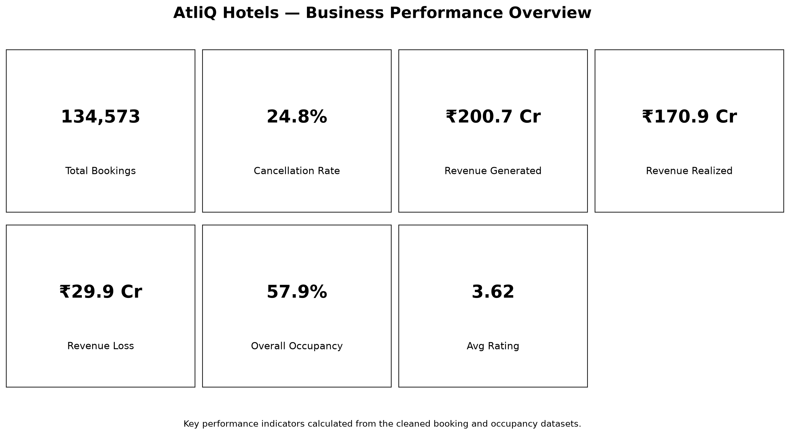
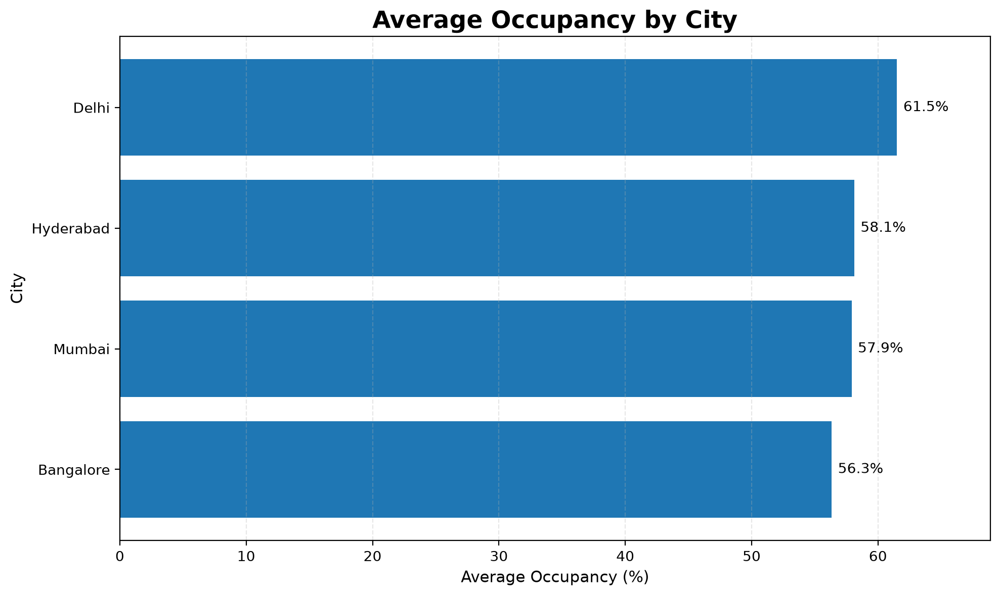
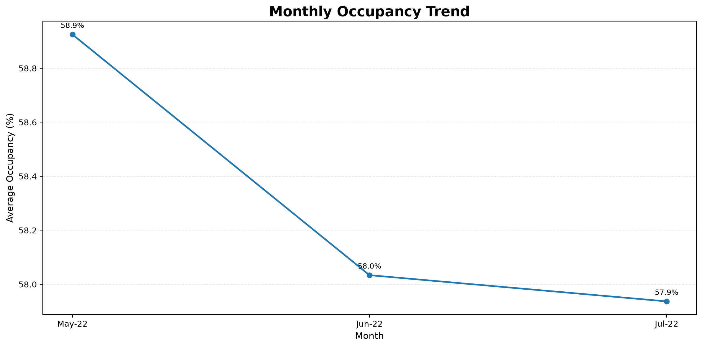
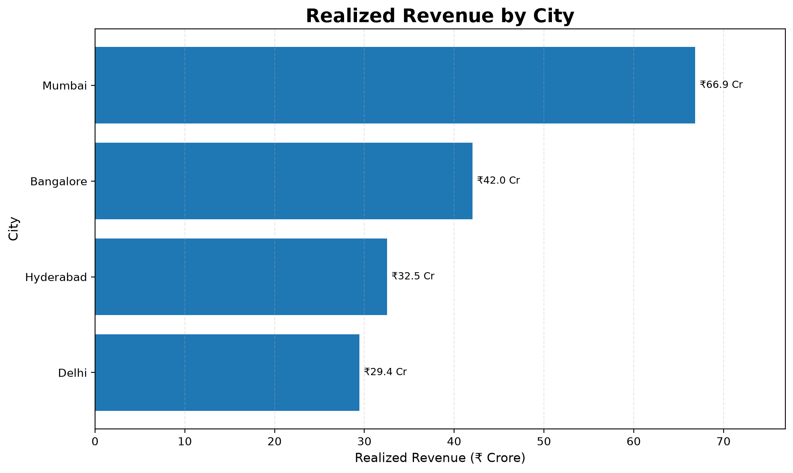
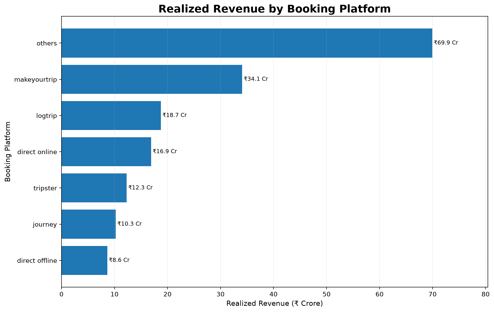
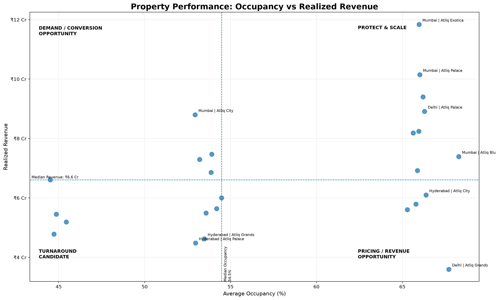

# 🏨 AtliQ Hotels — Revenue & Occupancy Analytics

**A portfolio-ready Python analytics project focused on hotel revenue, occupancy, booking channels, cancellations, customer ratings, and property performance.**

[](https://www.python.org/)
[](https://pandas.pydata.org/)
[](https://jupyter.org/)
[](https://git-scm.com/)

---

## 📌 Executive Summary

This project analyzes hotel booking and occupancy data to understand **commercial performance, demand utilization, booking-channel contribution, cancellation behavior, and property-level opportunities**.

The analysis follows an end-to-end Data Analyst workflow:

> **Raw Data → Data Quality → Cleaning → KPI Development → EDA → Performance Segmentation → Visualization → Business Insights → Recommendations**

Rather than stopping at descriptive charts, the project connects operational metrics such as **occupancy and cancellations** with commercial outcomes such as **realized revenue and revenue loss**.

---

## 🎯 Business Objective

Hotel management needs a clear and consistent view of performance across cities, properties, room classes, booking platforms, and time periods.

This analysis addresses questions such as:

- How much revenue was generated versus realized?
- What is the overall occupancy level?
- Which cities are strongest in occupancy?
- Which cities contribute the most realized revenue?
- How does occupancy change over time?
- Which booking platforms contribute the most realized revenue?
- Where is cancellation-related revenue leakage concentrated?
- Which properties are performing strongly?
- Which properties may have pricing, demand, or conversion opportunities?

---

# 📊 Executive KPI Snapshot

| KPI | Result |
|---|---:|
| **Total Bookings** | **134,573** |
| **Cancellation Rate** | **24.8%** |
| **Revenue Generated** | **₹200.7 Cr** |
| **Revenue Realized** | **₹170.9 Cr** |
| **Revenue Loss** | **₹29.9 Cr** |
| **Overall Occupancy** | **57.9%** |
| **Average Rating** | **3.62 / 5** |

> **Revenue Loss** is treated as the difference between revenue generated and revenue realized in this analysis. It should not automatically be interpreted as cancellation-only loss.

---

# 📈 Portfolio Visuals

## 1. Business Performance Overview

A high-level view of bookings, cancellations, revenue, occupancy, and customer ratings.



---

## 2. Average Occupancy by City

Delhi records the highest average occupancy at approximately **61.5%**, followed by Hyderabad (**58.1%**), Mumbai (**57.9%**), and Bangalore (**56.3%**).



---

## 3. Monthly Occupancy Trend

Average occupancy shows a small decline across the analyzed period:

- **May-22:** 58.9%
- **Jun-22:** 58.0%
- **Jul-22:** 57.9%

Because the available period is limited, this should be treated as a short-term observed movement rather than a long-term trend.



---

## 4. Realized Revenue by City

Mumbai is the leading revenue market with approximately **₹66.9 Cr** in realized revenue.

| City | Realized Revenue |
|---|---:|
| **Mumbai** | **₹66.9 Cr** |
| Bangalore | ₹42.0 Cr |
| Hyderabad | ₹32.5 Cr |
| Delhi | ₹29.4 Cr |



---

## 5. Realized Revenue by Booking Platform

The **Others** category contributes the highest realized revenue at approximately **₹69.9 Cr**, followed by MakeYourTrip at **₹34.1 Cr**.

| Booking Platform | Realized Revenue |
|---|---:|
| Others | ₹69.9 Cr |
| MakeYourTrip | ₹34.1 Cr |
| Logtrip | ₹18.7 Cr |
| Direct Online | ₹16.9 Cr |
| Tripster | ₹12.3 Cr |
| Journey | ₹10.3 Cr |
| Direct Offline | ₹8.6 Cr |

> `Others` represents an aggregated source category and should not be interpreted as a single booking partner.



---

## 6. Property Performance Matrix

Properties are evaluated using **average occupancy** and **realized revenue** against median thresholds.

This creates four management-oriented segments:

| Segment | Interpretation |
|---|---|
| **Protect & Scale** | High occupancy + high realized revenue |
| **Pricing / Revenue Opportunity** | High occupancy + lower realized revenue |
| **Demand / Conversion Opportunity** | Lower occupancy + high realized revenue |
| **Turnaround Candidate** | Lower occupancy + lower realized revenue |

These are **screening categories for management investigation**, not predictive models.



---

# 💡 Key Business Insights

### 1. Delhi leads occupancy

Delhi records the highest average occupancy at **61.5%**, approximately 3.6 percentage points above the overall occupancy of 57.9%.

**Business implication:** Delhi demonstrates comparatively stronger demand utilization and can be used as a benchmark for understanding demand and occupancy drivers.

---

### 2. Mumbai is the strongest realized-revenue market

Mumbai contributes approximately **₹66.9 Cr** in realized revenue, making it the largest revenue-generating city in the analyzed data.

**Business implication:** Mumbai should receive particular attention for revenue protection, pricing optimization, and customer retention.

---

### 3. Cancellation represents a meaningful commercial leakage area

The overall cancellation rate is **24.8%**, while the difference between generated and realized revenue is approximately **₹29.9 Cr**.

**Business implication:** Cancellation behavior should be investigated by property, city, booking platform, and other available dimensions to identify avoidable leakage.

---

### 4. Occupancy softened slightly during the observed period

Occupancy moved from **58.9% in May-22 to 57.9% in Jul-22**.

**Business implication:** The movement is small, but it is worth monitoring over a longer period to determine whether it represents seasonality, demand changes, pricing effects, or normal variation.

---

### 5. Booking-channel contribution is concentrated in the aggregated `Others` category

`Others` contributes approximately **₹69.9 Cr** in realized revenue.

**Business implication:** Understanding which individual platforms make up this category would improve channel-level decision-making and allow management to evaluate revenue contribution alongside commission and cancellation economics.

---

# 💼 Business Recommendations

## 1. Reduce cancellation-related leakage

Analyze cancellations across:

- City
- Property
- Booking platform
- Room class
- Customer/booking attributes available in the dataset

Potential actions can include reviewing cancellation policies, confirmation processes, booking lead times, and channel-specific behavior.

---

## 2. Investigate high-occupancy / lower-revenue properties

Properties with strong occupancy but relatively lower realized revenue may have opportunities around:

- Pricing
- Discounting
- Room-class mix
- Upselling
- Average Daily Rate

The objective is to improve revenue yield without unnecessarily sacrificing occupancy.

---

## 3. Protect high-performing properties

Properties in the **Protect & Scale** segment should be monitored for:

- Pricing opportunities
- Capacity constraints
- Customer retention
- Upselling
- Service-quality consistency

---

## 4. Monitor occupancy softness

The observed monthly decline should be tracked over additional periods before concluding that a structural demand problem exists.

Further analysis should investigate:

- Seasonality
- Pricing changes
- Competition
- Booking-channel mix
- Customer demand

---

## 5. Optimize booking-channel strategy

Booking platforms should ideally be evaluated using more than gross revenue.

A future channel-profitability analysis could incorporate:

- Commission
- Cancellation rate
- Customer acquisition cost
- Net realized revenue
- Occupancy contribution

This would help distinguish **high-volume channels from high-profit channels**.

---

# 🔍 Analytical Methodology

## 1. Data Loading

The project loads hotel dimension, booking, room, and aggregated occupancy/capacity data using Pandas.

## 2. Data Quality

The notebook checks for:

- Missing values
- Duplicate records
- Invalid guest counts
- Revenue outliers
- Missing capacity
- Bookings exceeding capacity
- Invalid dates

## 3. Data Cleaning

The analysis applies explicit validation rules before calculating business metrics.

Examples include:

- Removing invalid guest records
- Reviewing extreme revenue observations
- Validating successful bookings against capacity
- Standardizing date fields
- Preserving meaningful missing values where appropriate

## 4. KPI Development

The notebook calculates metrics including:

- Total bookings
- Cancelled bookings
- No-show bookings
- Cancellation rate
- No-show rate
- Revenue generated
- Revenue realized
- Revenue loss
- Revenue realization rate
- Occupancy
- Average customer rating

## 5. Exploratory Analysis

The project analyzes performance across:

- Cities
- Properties
- Room classes
- Booking platforms
- Months
- Weekdays and weekends

## 6. Property Segmentation

Properties are compared using median occupancy and realized revenue to create the four performance segments shown in the property matrix.

---

# 🗃️ Data Model

The project uses a fact/dimension-oriented structure.

```text
                    dim_date
                       │
                       │
dim_rooms ── fact_aggregated_bookings ── dim_hotels


                    dim_date
                       │
                       │
                  fact_bookings
                       │
                       │
                   dim_hotels
```

### Main datasets

| Dataset | Purpose |
|---|---|
| `dim_date.csv` | Calendar/date attributes |
| `dim_hotels.csv` | Hotel/property information |
| `dim_rooms.csv` | Room category information |
| `fact_bookings.csv` | Booking-level transactional data |
| `fact_aggregated_bookings.csv` | Aggregated bookings and capacity |
| `new_data_august.csv` | Additional August booking data |

---

# 🛠️ Technology Stack

### Data Analysis
- Python
- Pandas
- NumPy

### Visualization
- Matplotlib

### Development
- Jupyter Notebook
- VS Code

### Version Control
- Git
- GitHub

---

# 📂 Repository Structure

```text
atliq-hotels-revenue-occupancy-analytics/
│
├── data/
│   ├── raw/
│   └── processed/
│
├── notebooks/
│   └── AtliQ_Hotels_Portfolio_Analysis.ipynb
│
├── outputs/
│   └── figures/
│       ├── 01-kpi-overview.png
│       ├── 02-occupancy-by-city.png
│       ├── 03-monthly-occupancy-trend.png
│       ├── 04-revenue-by-city.png
│       ├── 05-booking-platform-performance.png
│       └── 06-property-performance.png
│
├── src/
│   └── README.md
│
├── .gitignore
├── requirements.txt
└── README.md
```

---

# ▶️ How to Run

## 1. Clone the repository

```bash
git clone https://github.com/prasanta-deb-data/atliq-hotels-revenue-occupancy-analytics.git
```

## 2. Navigate to the project

```bash
cd atliq-hotels-revenue-occupancy-analytics
```

## 3. Create a virtual environment

### Windows

```bash
python -m venv .venv
```

Activate:

```bash
.venv\Scriptsctivate
```

## 4. Install dependencies

```bash
pip install -r requirements.txt
```

## 5. Add the datasets

Place the required source CSV files in:

```text
data/raw/
```

The raw datasets are intentionally excluded from the public repository.

## 6. Launch Jupyter

```bash
jupyter notebook
```

Open:

```text
notebooks/AtliQ_Hotels_Portfolio_Analysis.ipynb
```

Then run the notebook from top to bottom.

---

# ⚠️ Dataset Availability

The raw and processed CSV datasets are intentionally excluded from the public GitHub repository through `.gitignore`.

This keeps the repository lightweight and avoids publicly redistributing source data without confirming its redistribution rights.

The notebook therefore requires the datasets to be available locally under the expected project data directory before execution.

---

# 📓 Main Notebook

**[AtliQ Hotels Portfolio Analysis](notebooks/AtliQ_Hotels_Portfolio_Analysis.ipynb)**

The notebook contains the complete analysis workflow, including:

- Data loading
- Data quality assessment
- Data cleaning
- KPI calculation
- Revenue analysis
- Occupancy analysis
- Cancellation analysis
- Booking-platform analysis
- Property performance
- Business segmentation
- Visualizations
- Business insights
- Recommendations

---

# 📌 Portfolio Skills Demonstrated

### Technical

- Python
- Pandas
- NumPy
- Matplotlib
- Jupyter Notebook
- Git
- GitHub

### Analytical

- Data cleaning
- Data validation
- Exploratory Data Analysis
- KPI development
- Aggregation
- Trend analysis
- Segmentation
- Performance benchmarking

### Business

- Revenue analysis
- Occupancy analysis
- Cancellation analysis
- Channel performance
- Property benchmarking
- Revenue leakage analysis
- Business recommendations

---

# 🎓 Project Outcome

This project demonstrates how raw hospitality data can be transformed into a structured business analysis that helps management:

**Measure → Compare → Diagnose → Prioritize → Act**

The key focus is not only identifying **what happened**, but translating the observed patterns into **business questions, potential opportunities, and recommendations for further investigation**.

---

# 👤 Author

## Prasanta Kumar Deb

**Data Analyst | Python | SQL | Power BI | Excel**

---

### ⭐ If you find this project useful

Explore the notebook, visualizations, and analytical methodology to understand the complete workflow from raw data to business recommendations.
